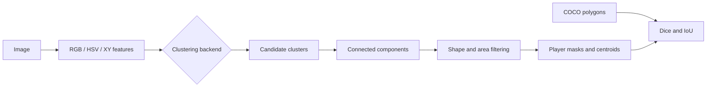

<div align="center">

# Football Player Segmentation with Clustering

**Unsupervised player-region discovery using colour, position, density, and spatial post-processing**

[](https://github.com/Mahdi-Jadidi/football-player-segmentation-clustering/actions/workflows/ci.yml)


</div>

## Overview

This project segments football players from broadcast images without training a detector or segmentation network. Each image is transformed into colour-spatial pixel features, clustered with one of three unsupervised methods, and converted into plausible player masks through connected-component and geometric filtering.

## Benchmark result

| Metric | Mean score |
|---|---:|
| Dice coefficient | **0.221** |
| Intersection over Union | **0.130** |

The scores are modest, which is itself an important result: colour clustering can recover useful player candidates, but background complexity, kit similarity, shadows, and perspective leave a large gap to supervised segmentation. The repository keeps that limitation visible instead of presenting selected overlays as proof of accuracy.

## Methods

| Backend | Strength | Main trade-off |
|---|---|---|
| K-Means | Fast global partitioning | Requires a fixed cluster count |
| DBSCAN | Separates dense local regions and noise | Sensitive to feature scaling and `eps` |
| Agglomerative | Flexible hierarchical grouping | Expensive for large pixel sets |

## Pipeline



## Repository layout

```text
src/image_segmentation/
├── data.py             # images and COCO polygons
├── features.py         # colour and spatial representations
├── clustering.py       # K-Means, DBSCAN, agglomerative
├── postprocess.py      # region cleanup and centroids
├── evaluation.py       # Dice and IoU
├── pipeline.py
└── cli.py
```

## Quick start

```bash
git clone https://github.com/Mahdi-Jadidi/football-player-segmentation-clustering.git
cd football-player-segmentation-clustering
pip install -e .
player-segmentation run --images-dir dataset/images \
  --annotations dataset/annotations/instances_default.json \
  --method dbscan --output-dir outputs
```

Use `player-segmentation benchmark --image path/to/image.jpg` to compare cluster quality before processing the full dataset.

## Outputs

Runs generate binary masks, player centroids, per-image Dice/IoU, aggregate metrics, and the resolved experiment configuration.

## Limitations and next steps

This is a classical unsupervised baseline. Stronger results would likely require learned visual embeddings, temporal information, pitch masking, or a supervised segmentation model. The current implementation is valuable as a transparent baseline with no annotation-dependent training stage.
